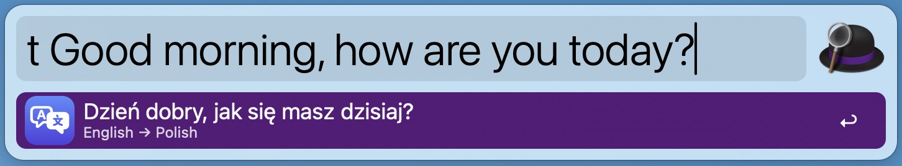
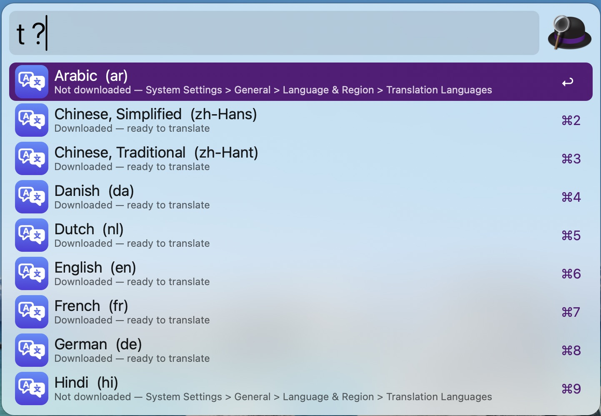
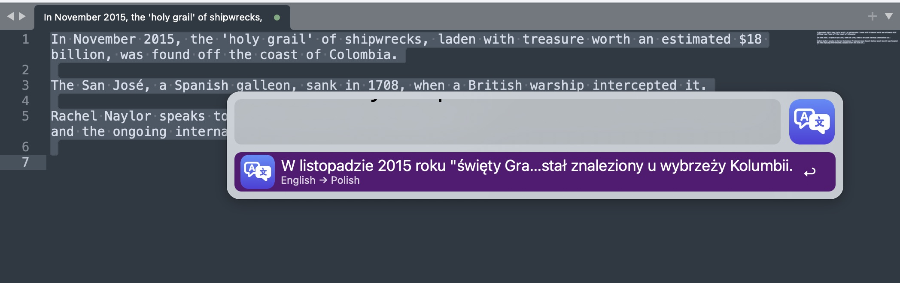

# Alfred Offline Translator

Alfred 5 workflow that translates text **fully offline**, using the translation models already
built into macOS. No API keys, no network, no account.

Type `t some text` in Alfred → the translation appears inline → <kbd>Enter</kbd> copies it.
The direction is detected automatically, so one keyword works both ways.

---

## Install

Download the latest `.alfredworkflow` from
**[Releases](https://github.com/kkujawinski/alfred-offline-translator-workflow/releases)**
and double-click it.

---

## Requirements

- macOS **26 (Tahoe)** or newer.
- Alfred 5 with the **Powerpack**.
- The languages you want, downloaded once (see below).

---

## Languages

23 languages are available. Most are already on your Mac; the rest download on demand.

| Status | Languages |
|---|---|
| Usually already installed | `da` `de` `en` `es` `fr` `it` `ja` `ko` `nb` `nl` `pt` `sv` `tr` `vi` `zh-Hans` `zh-Hant` |
| Need downloading | `pl` `ar` `hi` `id` `ru` `th` `uk` |

Type **`t ?`** to see exactly which are ready on your machine.

**To download one:** System Settings → General → Language & Region → **Translation Languages**
→ add the language. macOS cannot prompt for this from inside a workflow, so it is a one-off
manual step per language. If a model is missing, the workflow says so and points here instead
of failing silently.

The download is larger than it looks — roughly 1 GB per language family, because macOS bundles
speech recognition alongside the translation models. The translation models themselves are
about 210 MB.

---

## Usage

| Trigger | What it does |
|---|---|
| `t <text>` | Translate between your configured pair, direction detected |
| `t >de <text>` | Translate into German, source detected |
| `t de>en <text>` | Both languages given explicitly |
| `t ?` | List every language and whether it is downloaded |
| Universal Action → *Translate offline* | Translate the selection and paste it over the original |
| Hotkey (unassigned by default) | Same, without opening Alfred |

<kbd>Enter</kbd> copies the translation. <kbd>⌘</kbd><kbd>Y</kbd> shows it in large type.

### Settings

The **language pair** and the **keyword** are both in the Workflow's Configuration in Alfred —
no need to edit anything. Set the pair to `en,de`, `pt-BR,ja`, or any two supported codes, and
both directions work from the one keyword.

---

## Good to know

**Some pairs go through English.** Apple ships its models in families — Polish belongs with
English, Russian and Ukrainian; German with the western languages. So Polish → German has no
direct model however many languages you download. The workflow notices and translates in two
hops automatically, showing `Polish → English → German` as the subtitle. It costs about a third
of a second extra.

**Single words are the weak spot.** Apple's models resolve a bare word without context and
sometimes pick an unexpected sense — Polish `motyl` comes back as "Spinnaker", the sailing term,
rather than "butterfly". Adding a full stop or a few words of context fixes it. This is the
translation model itself, identical to what the Translate app gives.

**Speed.** Roughly half a second for a phrase, about a second for a full sentence. The keyword
waits for a short pause in typing rather than translating every keystroke.

**Quality is Apple's.** Good for everyday text; weaker than large cloud models on idioms,
technical jargon and long documents.

---

## Building it yourself

See [DEVELOPMENT.md](DEVELOPMENT.md) for the CLI, the build script, how the workflow is put
together, and the signing and release pipeline.
